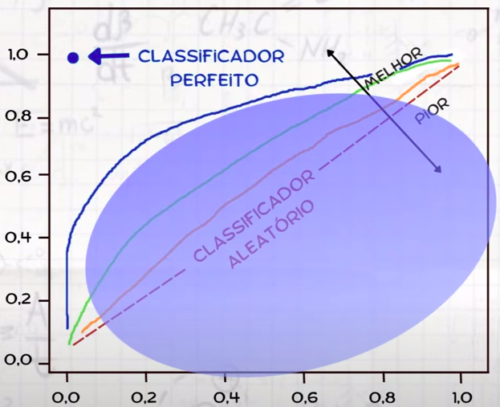

## Curvas de ROC e AUC

São medidas de precisão para modelos de classificação binária, com esta medida conseguimos idenficiar o quão capaz é o modelo de destinguir entre diferentes classes.

### ROC (Receiver Operating Characteristic):

A curva ROC nos diz o quão capaz um modelo é capaz de distinguir entre diferentes classes. Essa curva vai ser determinada com base em 2 parâmetros:

TPR e FPR

Explicando o conceito utlizando como contexto um modelo que deve dizer o paciente precisa ou não de uma consulta.

#### TPR

- TPR (True Positive Rate) =  TPR se dá por `TP/(TP + FN)`

- TP (true positive) = Modelo classificou que o paciente precisa de uma consulta e de fato o paciente precisa. ☑️
  
- FN (false negative) = Modelo classificou que o paciente não precisa de uma consulta, mas o paciente precisa. ❌

#### FPR

- FPR (False Positive Rate) =  FPR se dá por `FP/(FP + TN)`

- FP (false positive) = Modelo classificou que o paciente precisa de uma consulta, mas o paciente não precisa. ❌
  
- TN (true negative) =  Modelo classificou que o paciente não precisa de uma consulta e o paciente de fato não precisa. ☑️

<i>Dica: O que começar com T (de true) significa que o modelo acertou, seja pra afirmar ou negar</i>

### AUC:

Depois de gerar a curva ROC, calculamos a área que esta curva terá no nosso gráfico:

 

Vamos lá

Quanto maior a curva ROC, que na imagem acima esta representada por diferentes linhas azul, verde e laranja para simular diferentes situações, maior será o nível de eficiência de classficação do nosso modelo.

**A curva AUC é representada pela área entre o índice 0 do nosso eixo Y (o chão do gráfico :D), até linha traçada pela curva ROC** quanto maior essa área significa que mais assertivo foi o nosso modelo, pois mais próximo do ideal ele estava.

Esta imagem foi extraído do canal [@eficomvinho](https://www.youtube.com/@eficomvinho) e aqui [vídeo](https://www.youtube.com/watch?v=uLx2BKARl00) que explica muito bem a curva ROC e AUC (que no vídeo é chamado de ASC pela professora).